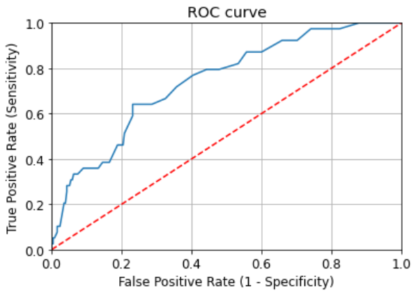
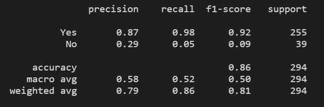
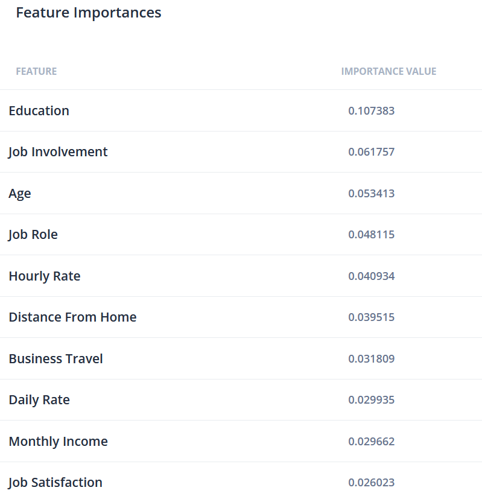
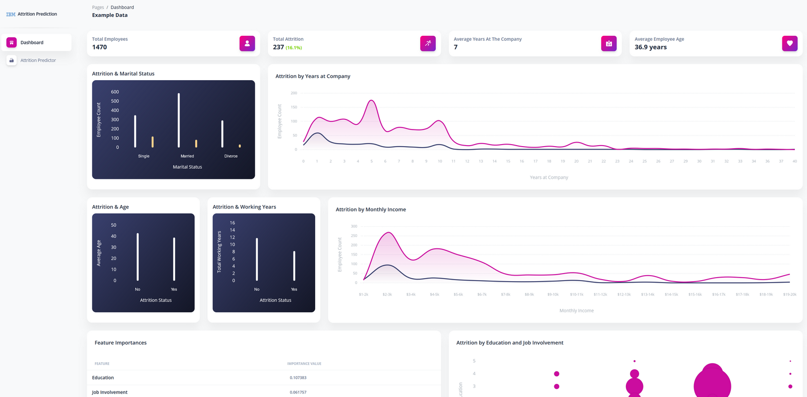
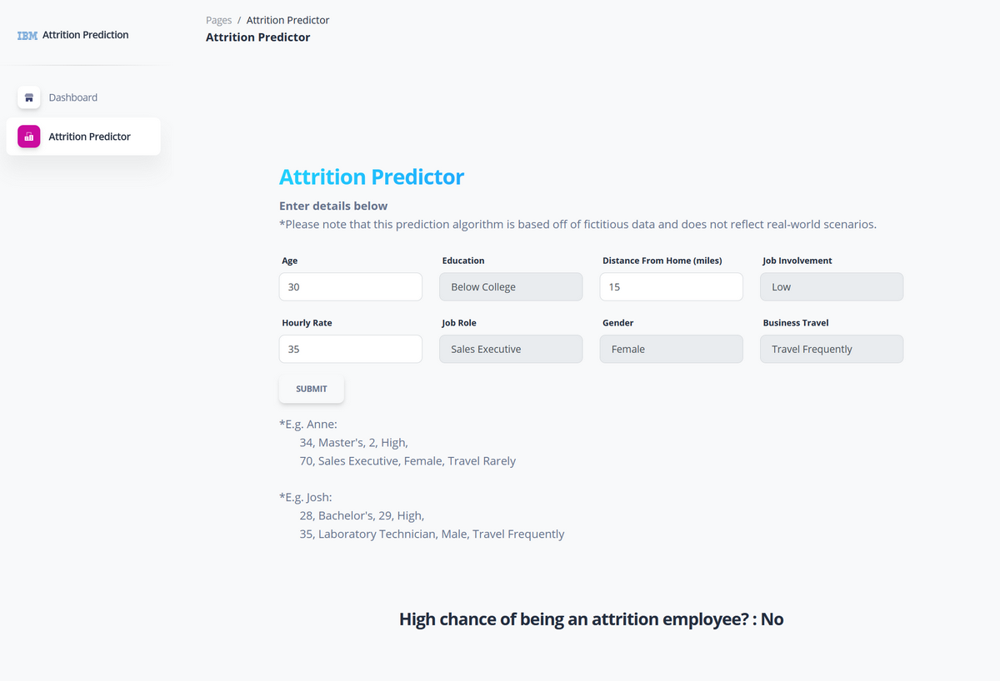
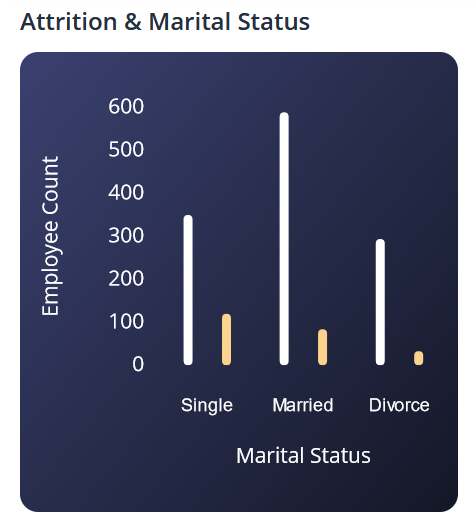
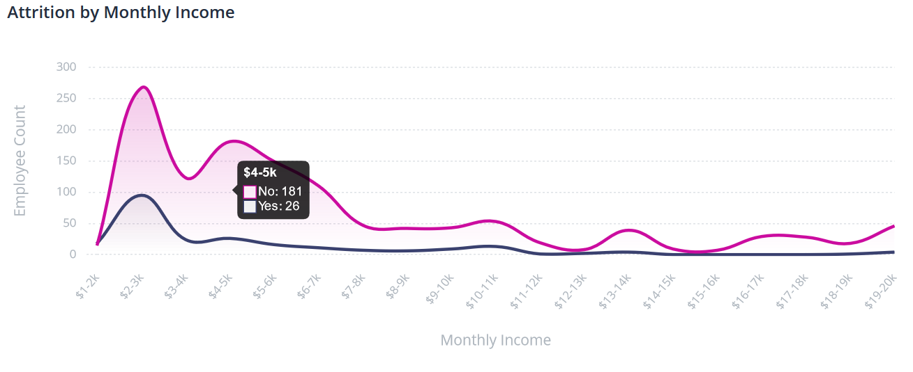
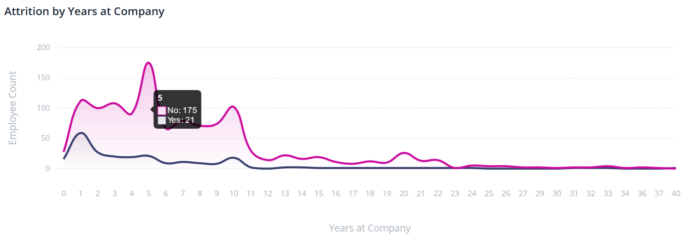
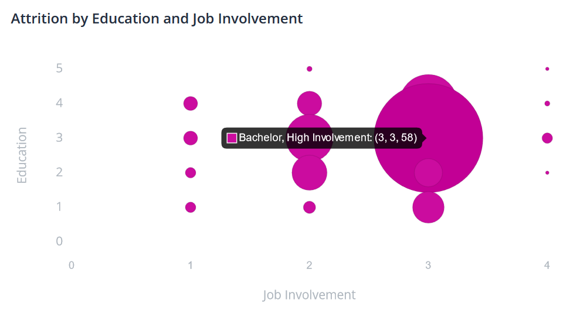

# Employee Attrition Prediction

Live Web App: https://project-3-ab-jr-jz-sw.herokuapp.com

## Summary
Using machine learning and web app infrastructure, a fabricated dataset was analyzed with machine learning to determine what factors may affect an employee's likeliness to leave an organization. A web app was created with both a dashboard visualizing the dataset and a user input form for users to use the prediction model created from the machine learning model's traning process.

## App/Files Workflow
### Data Description
The fabricated dataset below provided by IBM was used as the data to work with:
https://www.kaggle.com/pavansubhasht/ibm-hr-analytics-attrition-dataset

The dataset used was in tabular form, with each record as a different employee, and each column as different properties for an employee. The data was cleaned, removing any nominal data and any records with no data, resulting in 47 properties as the final working data. One-hot encoding was also applied for non-numerical data.

### Pre-Analysis
An RFE analysis was conducted to explore what features have the greatest affect in the attrition outcome, utilizing hyperparameter tuning on a random forest model using GridSearch. This was done through a Jupyter Notebook in ml_models/prediction_model3.ipnyb
 

The following feature importances were found:
 

### App Infrastructure
A Heroku app running from Python script was set up to allow a dashboard to show summary insights of the data, and a form for users to input unique information and run the newly created prediction model.
The main Python script uses Flask to operate a webpage to perform the following tasks:
* Display the webpage via Flask routes
* Retrieve user inputs from an HTML form (app.py) and run the prediction model on the retrieved data (ml_models/final_model.py).

#### Dashboard Page

To display the visualizations online, select charts of the dataset were generated through Mongo Charts The charts were exported as JavaScript and HTML code and adjusted to fit the dashboard template.

#### Prediction Form

On the "Attrition Predictor" page, users can enter in information to predict if an employee is likely to become an attrition employee.
The user-input data is sent through the HTML form into app.py, and operated on within the predict_attrition() function, defined within final_model.py. An output of "Yes" or "No" ("The employee will likely become an attrition employee" and "The employee will not likely become an attrition employee", respectively) is displayed back onto the page using Jinga.

## Results
Reviewing the data visually shows differences in Martial Status, Years at the Company, Working Years overall and Monthly Income. 
 
 

Correlations with employee attrition appear to exist within Education levels and Job involvement influencing the likeliness of attrition, for example the combination of bachelor's degrees and moderate involvement.
 

Real world applications may include employers who desire to reduce employee turnover weights, entering into discources with their employees about satisfaction of their job involvement, wage rates, commute, and overall job satisfaction.

## Credits
* (2017). IBM HR Analytics Employee Attrition & Performance. https://www.kaggle.com/pavansubhasht/ibm-hr-analytics-attrition-dataset
* (2020). End-to-End Machine Learning Project Tutorial — Part 1. https://dswharshit.medium.com/end-to-end-machine-learning-project-tutorial-part-1-ea6de9710c0
* (2021). Soft UI Dashboard. https://www.creative-tim.com/product/soft-ui-dashboard

## License
Soft UI Dashboard - Licensed under MIT (https://www.creative-tim.com/license)
